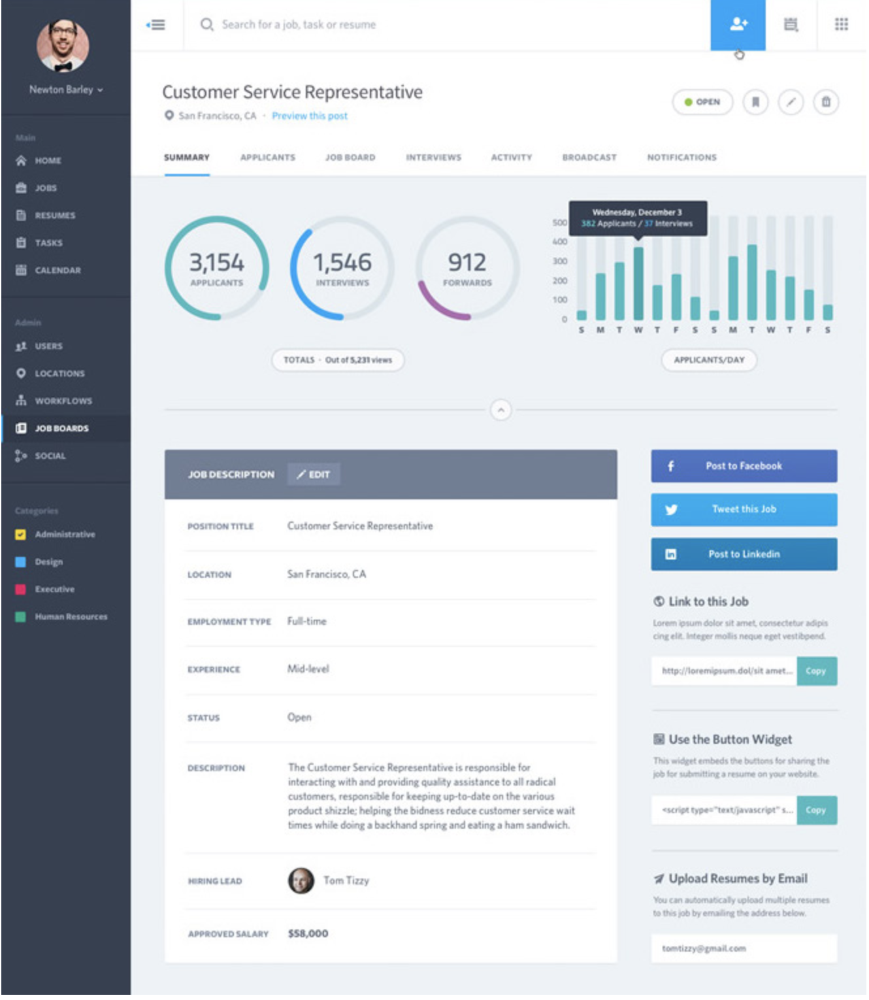
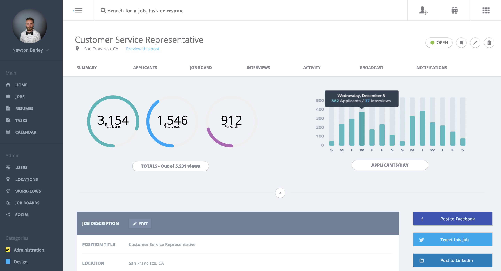
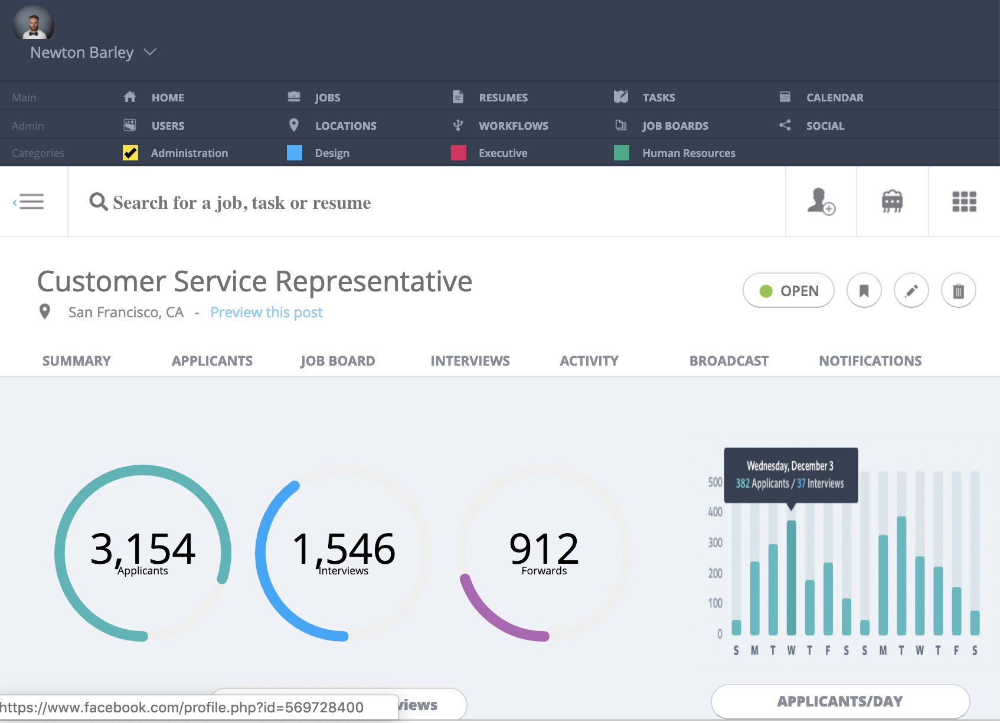
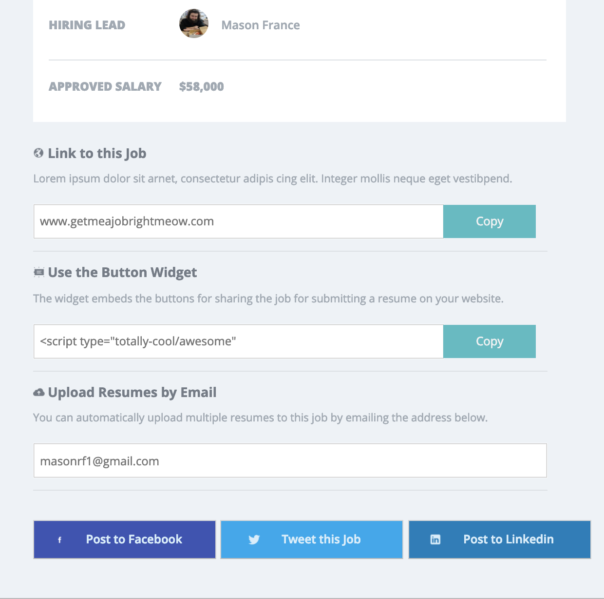

# Static Comp Challenge 2
This site was designed to fulfill the requirements of an assigned project for Turing School. We were given a picture of a website to recreate. This was our second project of this nature, and the comp was quite a bit more complex. We were challenged to create a more complex format, and could use CSS grid and flexbox. 
## What I gained from this project
I gained a lot of knowledge and experience using CSS grid and flexbox, and seeing how they can work together/within one another. Also, this comp presented challenges I had to research to solve, such as how to 'make' check-boxes, getting the background color to be different than default. Also, I did research to find a strategy to create the svg images, with an animation in the charts. Finally, I feel I am continually learning about how one solution in CSS can create other problems in other areas, and also the pitfalls of relying on pixel-perfect strategies for website- creation. In order to style the bottom borders for the table, I had to give each th and each td a different border, and they would sometimes move at different times depending on the line number of the paragraph, so I had to use a few too many media queries to make sure the border moved all together. I would possible try a different strategy next time, as I did not have a chance to test i all browsers, and am unsure if this would come out slightly different on some.
### Screenshots
Here is a look at what we were asked to replicate:

Here is what I made:

Here are a few looks at different screen sizes:

