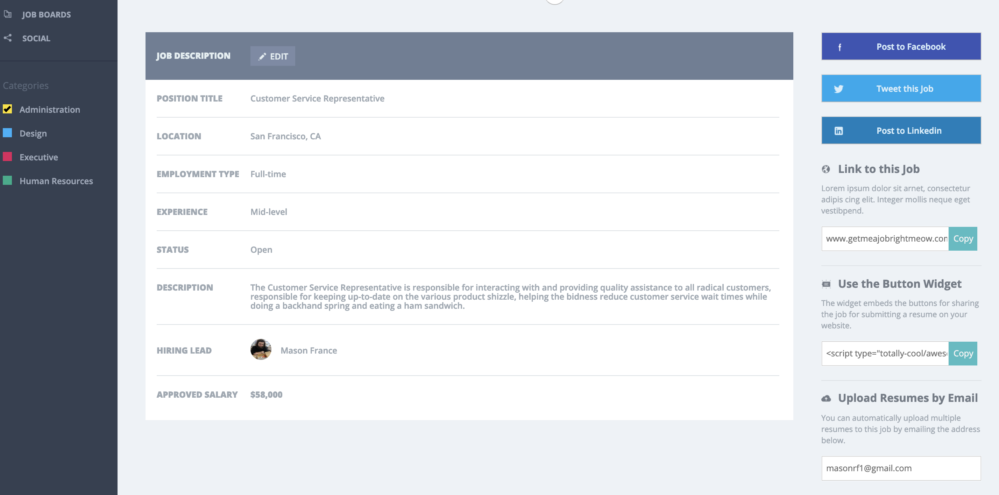

# Static Comp Challenge 2
This site was designed to fulfill the requirements of an assigned project for Turing School. We were given a picture of a website to recreate. This was our second project of this nature, so the comp was quite a bit more complex. I used CSS grid and flexbox to achieve the challenging design and to allow for different areas to collapse depending on the screen size. 

### Screenshots
My site:

Different formats for different screen-sizes:

Comp design:

## What I gained from this project
I gained a lot of experience using CSS grid and flexbox, seeing how they can be used together. Also, this comp presented challenges I had to research to solve, such as how to 'style' check-boxes and finding a strategy to create the svg images for the charts. Finally, I learned about how a CSS solution can create another problem, and also about the pitfalls of relying on pixel-perfect strategies for website creation. In order to style the bottom borders for the table, I had to give <th> elements and <td> elements different borders that would sometimes move at different times depending on the line number of the paragraph, so I ended up using more media queries than I would have liked to make sure the borders moved at the same time. I would try a different strategy next time, as I did not have a chance to test in varying browsers, and I am sure this site would look differently on some. Creating this site was most certainly a learning experience that has lead me to consider varying screen-sizes as I start design.
